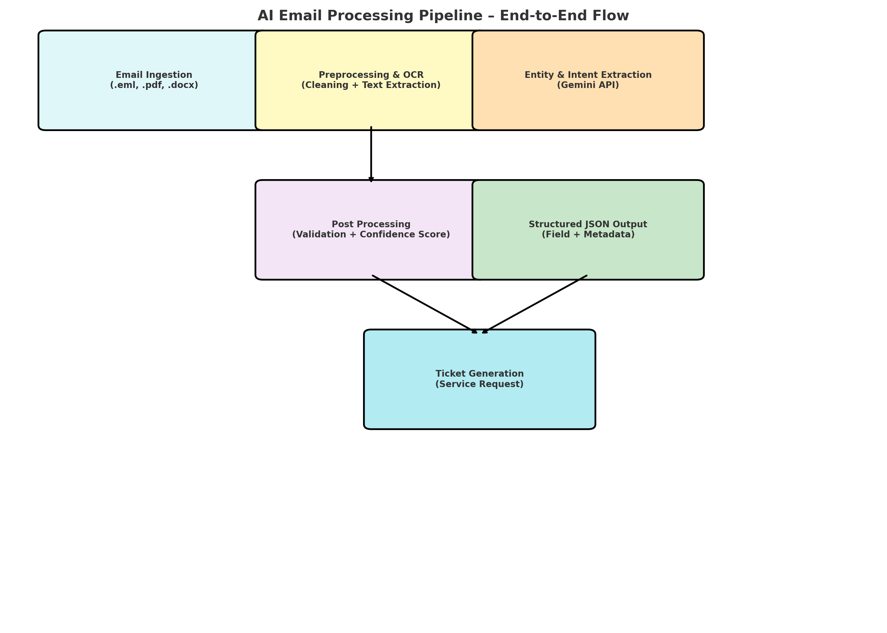
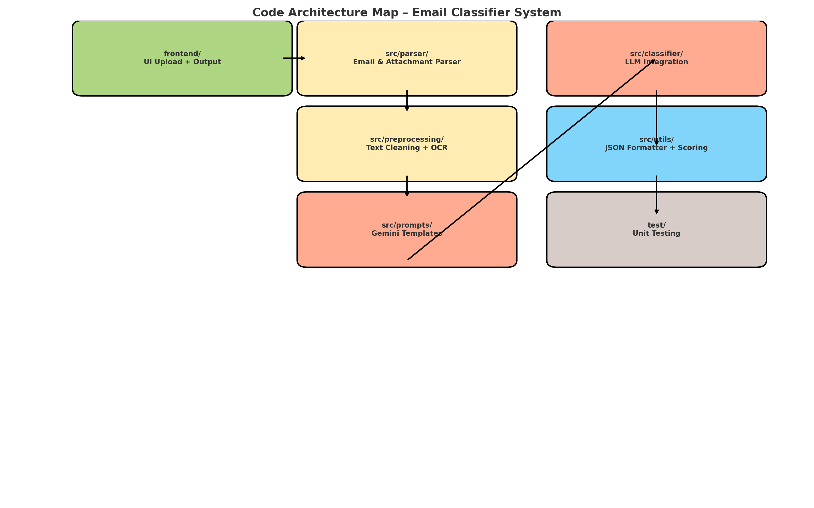

# 🚀 Project Name

## 📌 Table of Contents
- [Introduction](#introduction)
- [Demo](#demo)
- [Inspiration](#inspiration)
- [What It Does](#what-it-does)
- [How We Built It](#how-we-built-it)
- [Challenges We Faced](#challenges-we-faced)
- [How to Run](#how-to-run)
- [Tech Stack](#tech-stack)
- [Team](#team)

---
# GenAI-Powered Email Processing System

## 🎯 Introduction
This document provides a comprehensive guide for developers seeking to understand, utilize, and extend the AI-powered email processing system. The system is designed to extract key information from emails in various formats (.eml, .pdf, .docx) and classify them based on their content and create a service request and route the request to the respective teams or individuals based on skills and roles

## 🎥 Demo
🔗 [Live Demo](#) (if applicable)  
📹 [Video Demo - PART 1](Please refer : artifacts/demo/GenAI Email Classifier - Elite Eagles_PART1.mp4) 

📹 [Video Demo -PART 2](Please refer : artifacts/demo/GenAI Email Classifier - Elite Eagles_PART2.mp4)

## 🖼️ Architecture Diagram:




## Screenshots PDF
[Go to screenshots PDF](artifacts/arch/GenAI Email Classifier-UI Screenshots.pdf)

## 💡 Inspiration
Business Description:
Our AI-powered Email Processing System solves critical financial communication challenges by automatically classifying, extracting, and routing emails containing complex financial information. The solution dramatically reduces manual processing time, minimizes human error, and ensures consistent handling of diverse email communications across financial operations.
Technical Description:
A Python-based, AI-driven email processing pipeline that leverages Google Generative AI and OCR technologies to:

Ingest multi-format documents (EML, PDF, DOCX)
Extract text and image-based content
Classify emails using machine learning
Generate structured service intake requests
Support intelligent routing and attribute extraction

Key Technical Components:

Language: Python
AI Engine: Google Generative AI (Gemini)
OCR: Pytesseract
Supported Formats: EML, PDF, DOCX
Output: Structured JSON
Processing: Modular, extensible pipeline

## ⚙️ What It Does
Solution: 
The system follows a modular AI pipeline architecture:

 1. Ingestion Collection Stage : Gathers email data from different sources.
 2. Preprocessing: processs the emails in various formats (.eml, .pdf, .docx) and extracts the email text
 3. Metadata Extraction: Extracts email headers (sender, recipient, etc.).   
 4. Email Signature Detection: Identifies and extracts email signatures.  
 5. Confidence Score
 6. Key Attributes Extraction: Uses the Gemini API to extract specific data from the email body (dates, amounts, etc.).   
 7. Content Classification: Employs the Gemini API to classify emails into request types and sub request types.  

## 🛠️ How We Built It
## Dependencies
* Python 3.12.6
* pip (Package Installer for Python)
* A virtual environment (recommended)

## Setup

1.  **Clone the repository:**

    ```bash
    git clone https://github.com/ewfx/gaied-elite-eagles
    cd Email_Classification_Project
    ```

2.  **Create and activate a virtual environment:**

    ```bash
    C:\Syed\Workspace\Hackathon_2025\Email_Classification_Project>python --version
    Python 3.12.6

    C:\Syed\Workspace\Hackathon_2025\Email_Classification_Project>pip --version
    pip 24.2 from C:\Syed\Workspace\Hackathon_2025\python-3.12.6\Lib\site-packages\pip (python 3.12)

    C:\Syed\Workspace\Hackathon_2025\Email_Classification_Project>python -m venv my_env

    C:\Syed\Workspace\Hackathon_2025\Email_Classification_Project>my_env\Scripts\activate

    (my_env) C:\Syed\Workspace\Hackathon_2025\Email_Classification_Project>
    ```

3.  **Install package dependencies:**

    ```bash
    pip install google-generativeai
    pip install requests
    pip install pandas
    pip install matplotlib
    pip install requests
    pip install transformers
    pip install torch PyPDF2 pytesseract pdf2image
    pip install openai
    pip install spacy

    ```
  
4.  **Install Tesseract OCR (for PDF text extraction):**

    * You'll need to install Tesseract OCR separately.
    * **Windows:** Download the installer from [https://github.com/UB-Mannheim/tesseract/wiki](https://github.com/UB-Mannheim/tesseract/wiki) and add the Tesseract executable to your system's PATH environment variable.
   
5.  **Configure API Keys:**

    * Obtain the necessary API keys from Google Generative AI,and add the API key to the `genai_email_classifaction_engine.py` file

6.  **Run the application:**

    ```bash
    python src/main/genai_email_classifaction_engine.py #or however you start your program.
    ```
## Output

The system outputs extracted data and classification results in JSON format.

JSON Response : Email Classification
```bash
{
    "Request Type": "Money Movement-Inbound",
    "Sub-Request Type": "Principal",
    "Confidence": 0.95,
    "Metadata": {
        "From": "Bank of America <notifications@bofa.com>",
        "To": "Wells Fargo National Association <transactions@wellsfargo.com>",
        "Subject": "Loan Repayment Notification - John Cena L.P.",
        "Date": "Fri, 10 Nov 2023 09:00:00 -0500",
        "Content-Type": "text/plain; charset=\"UTF-8\""
    },
    "Signature": {
        "Signature Type": "Best regards",
        "Signature Content": "Loan Processing Team  \nBank of America"
    },
    "Attributes": {
        "Loan Repayment Date": "10-Nov-2023",
        "Repayment Amount": "USD 10,000,000.00",
        "Deal CUSIP": "123456789",
        "Deal ISIN": "US1234567890",
        "Facility CUSIP": "987654321",
        "Facility ISIN": "US9876543210",
        "Lender MEI": "ABCD1234",
        "Borrower": "John Cena L.P.",
        "Previous Global Principal Balance": "USD 50,000,000.00",
        "New Global Principal Balance": "USD 40,000,000.00",
        "Recipient Bank Name": "Wells Fargo National Association",
        "Recipient Bank ABA Number": "123456789",
        "Recipient Bank Account No": "987654321",
        "Recipient Bank Reference": "LOAN-123456",
        "Term Option": "SOFR (UST)",
        "Sender Bank Name": "Bank of America",
        "Phone": "(123)-456-7890",
        "Fax": "(987)-654-3210",
        "Email": "loanprocessing@wellsfargo.com"
    }
}
```

JSOPN Response : Service Intake Request

```bash
        {
            "Request Type": "Money Movement-Inbound",
            "Sub-Request Type": "Principal",
            "Assigned To": "Loan Processing Team",
            "Summary": "Loan repayment of USD 10,000,000.00 for John Cena L.P. (Deal CUSIP: 123456789) effective 10-Nov-2023",
            "Priority": "Medium",
            "Description": "Notification of a loan repayment of USD 10,000,000.00 from John Cena L.P., effective 10-Nov-2023.  Confirmation of receipt and processing is requested.",
            "Details": {
                "Sender": "Bank of America <notifications@bofa.com>",
                "Recipient": "Wells Fargo National Association <transactions@wellsfargo.com>",
                "Subject": "Loan Repayment Notification - John Cena L.P.",
                "Loan Repayment Date": "10-Nov-2023",
                "Repayment Amount": "USD 10,000,000.00",
                "Deal CUSIP": "123456789",
                "Deal ISIN": "US1234567890",
                "Facility CUSIP": "987654321",
                "Facility ISIN": "US9876543210",
                "Lender MEI": "ABCD1234",
                "Borrower": "John Cena L.P.",
                "Previous Global Principal Balance": "USD 50,000,000.00",
                "New Global Principal Balance": "USD 40,000,000.00",
                "Recipient Bank Name": "Wells Fargo National Association",
                "Recipient Bank ABA Number": "123456789",
                "Recipient Bank Account No": "987654321",
                "Recipient Bank Reference": "LOAN-123456",
                "Term Option": "SOFR (UST)",
                "Sender Bank Name": "Bank of America",
                "Phone": "(123)-456-7890",
                "Fax": "(987)-654-3210",
                "Email": "loanprocessing@wellsfargo.com"
            }
        }
```
## File Details

* `genai_email_classifaction_engine.py`: Contains the main email processing logic.

## 🚧 Challenges We Faced
Describe the major technical or non-technical challenges your team encountered.

## 🏗️ Tech Stack
- 🔹 Frontend: React/TailwindCSS
- 🔹 Backend: Node.js / FastAPI / Django
- 🔹 Database: MongoDB
- 🔹 Other: Google Gemini/Open AI

## 👥 Team
- **Syed Ahmed Ali**
- **Konabhai Veera**
- **Samaddar Satyendra**
- **Bekkam Nagaraju**
- **Challa BalaKishore**
